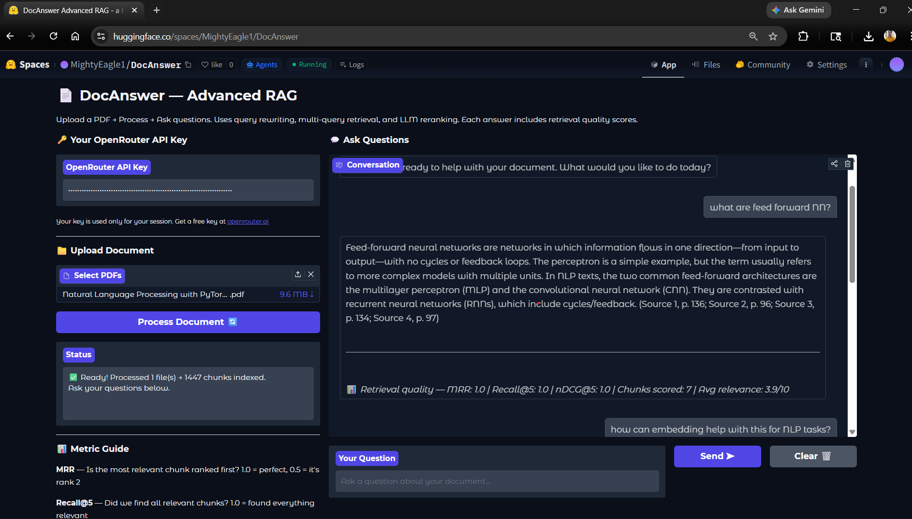

## Demo




# 📄 DocAnswer — Advanced RAG Pipeline

> Ask questions. Get answers. Strictly from your document — no hallucinations, no guessing.

**Live Demo → [HuggingFace Spaces](https://huggingface.co/spaces/MightyEagle1/DocAnswer)**

---

## What is this?

DocAnswer is a production-deployed Retrieval-Augmented Generation (RAG) system that answers questions from uploaded PDF documents. It goes well beyond basic RAG by implementing a multi-stage retrieval pipeline that maximizes both coverage and precision — finding the right chunks, then ranking them correctly before generating an answer.

Every answer is strictly grounded in the uploaded document with source citations and page numbers. If the answer isn't in the document, the system says so explicitly.

---

## Pipeline

```
User Question
     │
     ▼
Query Rewrite          ← LLM cleans up the question into a precise search query
     │
     ▼
Multi-Query Expansion  ← Generates 3 semantic variations of the query
     │
     ▼
Retrieve 20 Chunks     ← 5 chunks per query variation, deduplicated
     │
     ▼
LLM Reranking          ← Scores every chunk 0–10 for relevance, picks top 5
     │
     ▼
Answer + Citations     ← Strict document-only response with source + page number
     │
     ▼
Eval Metrics           ← MRR, Recall@5, nDCG@5 shown with every answer
```

---

## Why not just basic RAG?

Basic RAG — embed question, retrieve top-k chunks, answer — has two failure modes:

**Coverage failure:** The user's exact phrasing doesn't match how the document expresses the concept. A question about "revenue" misses chunks that say "sales income." Multi-query expansion solves this by generating semantic variations and retrieving against all of them.

**Precision failure:** Vector similarity doesn't understand relevance — it measures distance in embedding space, not actual usefulness to the question. LLM reranking solves this by reading both the question and each chunk together and scoring them like a human would.

The result: broader recall, higher precision, better answers.

---

## Features

- **Query rewriting** — fixes grammar, removes filler words, makes the search query precise
- **Multi-query expansion** — 3 semantic variations × 5 chunks = up to 20 unique candidates
- **LLM reranking** — cross-encoder style relevance scoring (0–10) on every candidate chunk
- **Source citations** — every answer references the source filename and page number
- **Retrieval metrics** — MRR, Recall@5, and nDCG@5 shown automatically with each answer
- **Conversation memory** — remembers last 5 turns for natural follow-up questions
- **Multi-PDF support** — upload and query multiple PDFs at once
- **BYOK** — Bring Your Own Key; users provide their OpenRouter API key in the UI

---

## Tech Stack

| Layer | Technology |
|---|---|
| LLM & Embeddings | OpenRouter API (gpt-4o-mini + text-embedding-3-large) |
| Orchestration | LangChain |
| Vector Store | ChromaDB (stateless, rebuilt per session) |
| PDF Loading | PyMuPDF via LangChain Community |
| UI | Gradio |
| Deployment | Hugging Face Spaces |

---

## Retrieval Metrics Explained

Every answer in DocAnswer includes three retrieval quality scores:

**MRR (Mean Reciprocal Rank)** — measures whether the most relevant chunk is ranked first. Score of 1.0 means the top chunk was the best one. Score of 0.5 means the best chunk was ranked second.

**Recall@5** — of all chunks the reranker considered relevant (score ≥ 5), how many made it into the final top 5? Score of 1.0 means nothing relevant was left behind.

**nDCG@5 (Normalized Discounted Cumulative Gain)** — measures whether high-scoring chunks are ranked higher than low-scoring ones. Penalizes putting a score-9 chunk at rank 5 when a score-3 chunk is at rank 1.

Together: MRR = precision, Recall@5 = coverage, nDCG = ranking quality.

---

## Local Setup

```bash
# 1. Clone the repo
git clone https://github.com/YOUR_USERNAME/docAnswer.git
cd docAnswer

# 2. Install dependencies
pip install -r requirements.txt

# 3. Create a .env file
echo "OPENAI_API_KEY=your_openrouter_key_here" > .env

# 4. Run
python app.py
```

Get a free OpenRouter API key at [openrouter.ai/keys](https://openrouter.ai/keys).

---

## Project Structure

```
docAnswer/
├── app.py              # Full pipeline + Gradio UI
├── requirements.txt    # Dependencies
└── README.md
```

---

## Limitations

- ChromaDB is stateless — the vector store is rebuilt every time a new PDF is uploaded. This is intentional for simplicity; a persistent deployment would use Pinecone or pgvector.
- Reranking calls the LLM once per retrieved chunk — on large PDFs with many chunks this adds latency. A dedicated reranker model (e.g. Cohere Rerank) would be faster.
- Multi-user sessions share the same global retriever — not suitable for concurrent multi-user production use without session isolation.

---

## Author

**Abhishek Kumar Sahu**
B.Tech Mechanical Engineering | M.Sc Data Science (Chandigarh University)
Transitioning into Agentic AI Engineering

[LinkedIn](https://www.linkedin.com/in/abhishekksahu/) · [GitHub](https://github.com/AbhishekSahu-GG) · [HuggingFace](https://huggingface.co/MightyEagle1)
